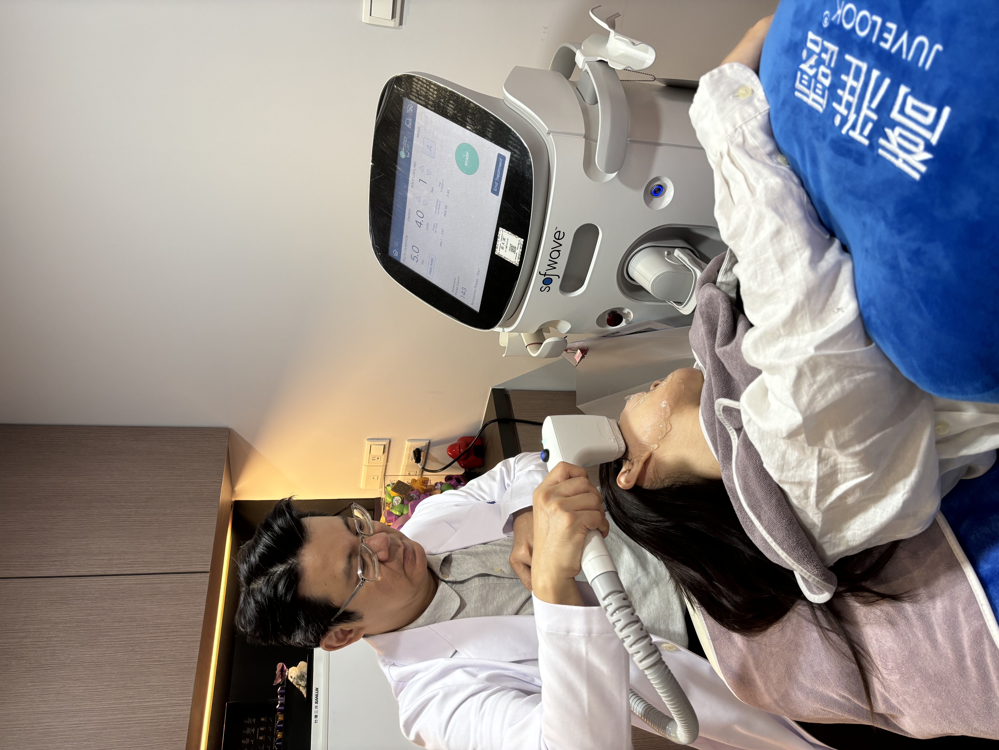

很多人對醫美的想像，是「走進診所、打打雷射、打打針，做完就走」。價格便宜就好，反正只是變美的小事——但真的是這樣嗎？

其實，醫美從來不只是「一次性的消費」。它是一段醫病關係：一位醫師要了解你的膚況、你的期待、你的顧慮，才能給出適合你的建議。而這段關係的品質，往往比單次的價格更值得在意。

*專業的醫療評估與操作，是醫病關係的一部分。*

## 便宜行事，可能有看不見的代價

價格透明、貨比三家，本身沒有錯。但如果「便宜」成為唯一的考量，有些成本其實只是被藏起來、而不是真的消失了。

例如：諮詢時間被壓縮，醫師沒有足夠時間了解你的狀況；療程前後的評估與追蹤變得草率；或是為了壓低價格，在其他你看不到的地方打了折扣。這些不會寫在價目表上，卻可能影響到最重要的東西——安全與結果。

## 那，貴就一定好嗎？

也不是。高價不等於高品質，更不等於「適合你」。有時候你付的，是裝潢、是行銷、是品牌溢價，而不是真正落在你身上的專業與照顧。

所以這篇文章想說的，其實不是「選貴的」，而是——在滿街診所裡，怎麼挑到適合你的醫師。

## 怎麼挑到「適合你的醫師」

與其糾結價格高低，不如把注意力放回「人」身上。幾個可以觀察的方向：

一、諮詢時，醫師願不願意好好跟你說清楚。願意花時間了解你、把療程的原理、可能的風險與恢復期都講明白的醫師，通常更值得信任。

二、會不會誠實地「勸退」。一位好的醫師，有時會告訴你「這個你其實不需要做」。願意為你踩剎車、而不是一味加項目的，往往更把你的需求放在前面。

三、有沒有完整的術前評估與術後追蹤。醫美不是做完就結束，後續的照顧與回應，是這段醫病關係是否負責任的重要指標。

四、你在對話裡，感覺自在嗎。能讓你安心提問、不會被急著推銷的環境，本身就是一種品質。

## 回到「減法思維」

我們始終相信，醫美不是加得越多越好，而是找到真正適合你的選擇。

價格會浮動，行銷會包裝，但「適合」與「安心」是騙不了人的。願每一個想變美的你，都能在做決定前，先找到一位願意好好聽你說話的醫師。
