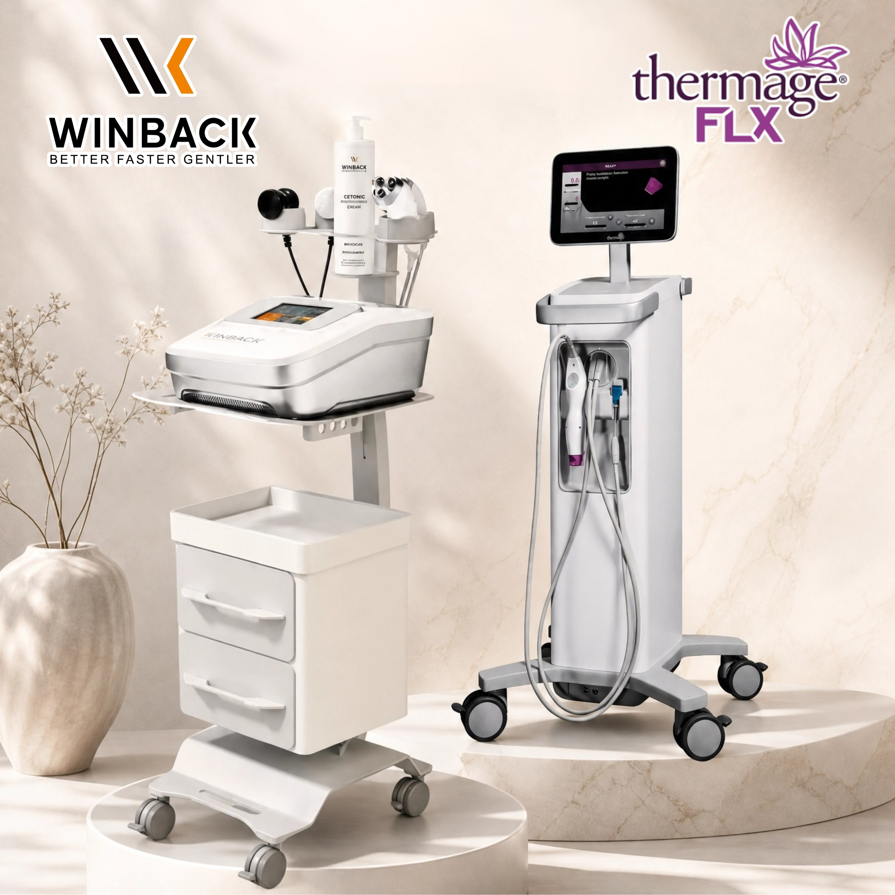

「電波拉皮」這個詞，在台灣的醫美廣告裡出現太多次了，多到讓人開始懷疑：這真的有用嗎？還是只是行銷話術？

今天不談廣告，只談研究。

*RF 高頻電波相關儀器*

## RF 高頻電波作用於皮膚，科學機制是什麼？

「電波拉皮」的正式技術名稱是「射頻治療（Radiofrequency，簡稱 RF）」，台灣醫療院所常稱為「RF 高頻電波緊膚」或「電波治療」。

RF 高頻電波的核心作用原理，是透過高頻電磁能量在皮膚深層產生熱效應，刺激真皮層的膠原蛋白重新合成與結構改變。

這個機制在過去十年間已累積相當數量的基礎與臨床研究，以下整理幾篇有代表性的文獻，並一併說明它們的研究限制。

## 臨床研究一：聚焦式 RF 用於臉部皺紋與鬆弛

2025 年刊登於 PubMed/PMC 的研究（PMCID: PMC12243918），由中國湖北醫藥學院附屬醫院醫學美容科進行，針對數十名年齡約 36–58 歲的女性患者，評估聚焦式 RF 高頻電波技術用於臉部皺紋與鬆弛的觀察。

每位患者接受 3 次療程，每次間隔約 2 個月。研究觀察到臉部皺紋與皮膚鬆弛在療程後有改善的趨勢，且療程期間及之後均未發生嚴重不良反應。研究結論指出，RF 高頻電波技術在改善臉部皺紋與鬆弛方面具有臨床上的觀察意義。

> **研究限制：** 此為特定族群、樣本規模有限的臨床觀察，結果不代表所有人的療程效果。

## 臨床研究二：多極 RF 療程的獨立盲評觀察

2017 年發表於《Dermatology Research and Practice》（PMCID: PMC5360959），由巴西 Universidade Fumec 皮膚科進行，針對少數有輕至中度光老化的患者，進行多次多極 RF 高頻電波療程（每週一次）。此研究使用的是文獻中所述的一款多極射頻加脈衝電磁場複合設備。

由兩位獨立評估者盲評，結果觀察到受試者的皮膚鬆弛度與臉部輪廓有改善的趨勢。此研究採用雙盲獨立評估設計，具有基本方法學上的參考價值。

> **研究限制：** 論文作者本身即指出，樣本數偏小、缺乏長期追蹤是主要限制。

## 臨床研究三：熱刺激本身是否足以啟動再生？

2025 年《Journal of Cosmetic Dermatology》刊登的研究（Bai Y et al., DOI: 10.1111/jocd.16600），由上海交通大學醫學院附屬第九人民醫院整形外科進行，結合離體豬皮、離體人體皮膚及臨床試驗，探討雙極 RF 高頻電波的熱效應機制。

研究探討的重點在於：適當的熱刺激（在不造成組織損傷的溫度範圍內）是否就能誘發膠原蛋白結構改變，而不需要造成「熱損傷」。

這個研究的意義在於說明：RF 高頻電波的「適量熱刺激」與「過度熱損傷」是兩件不同的事——有效的療程設計理論上不需要讓皮膚受傷。這對參數控制與操作安全的理解，具有臨床參考意義。

> **研究限制：** 機制研究結合了離體樣本與臨床試驗，臨床部分樣本規模有限，仍需更多研究佐證。

## TECAR 高頻電療，和一般「電波拉皮」有什麼不同？

很多人做過的「電波拉皮」，使用的是單極或雙極 RF 高頻電波，能量作用集中在皮膚表淺至中層，以緊緻膚質為主要方向。

TECAR 使用的是「電容電阻式高頻電療」（CET/RET），同樣屬於 RF 高頻電波技術，但頻率範圍與雙模式設計，原本針對更深層的肌肉與結締組織的循環支持。

兩者物理原理相通，但研究資料的累積方向不同：

- **一般電波拉皮設備**：較多臉部皮膚緊緻的相關研究。
- **TECAR**：較多物理治療、運動醫學方向的研究。

臉部應用方面，TECAR 技術目前文獻仍在持續累積中。如有興趣，建議諮詢具備相關資質的醫療人員。

## 誠實的提醒

> 以上三篇均為真實可查的學術文獻，但每篇都有其研究限制（樣本數、追蹤時間、設備差異等）。科學誠實要求我們同時呈現結果與限制。
>
> 任何宣稱「保證有效」的說法，都值得存疑；任何有文獻支撐、由合格醫療人員操作的療程，值得認真了解。
>
> 本文為研究資料整理，不代表個人療程效果。所有療程應由合格醫療人員依個人狀況評估後進行。

---

**文獻來源：**

1. Liu H et al. World J Clin Cases. 2025;13(25):97335. PMCID: PMC12243918
2. de Oliveira TC et al. Dermatol Res Pract. 2017;2017:4146391. PMCID: PMC5360959
3. Bai Y et al. J Cosmet Dermatol. 2025;24(1):e16600. DOI: 10.1111/jocd.16600

---

*本文由無痕美學診所整理，為學術研究資料之衛教整理，不構成醫療建議，也不代表個人療程效果。實際療程適應症、效果、風險與恢復期，皆需以合格醫療人員面診評估為準。*
